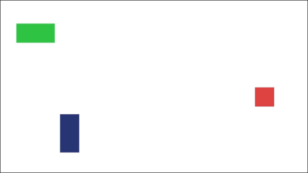
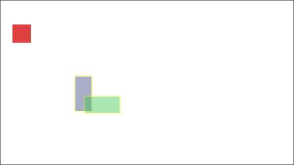

# Quickstart

These examples are simple cases to quickly understand how to use HitboxJS.

* [Detect any collision and add a custom class](quickstart.md#example-1-detect-any-collision-and-add-a-custom-class)
* [Destroy an "enemy" with a "bullet"](quickstart.md#example-2-destroy-an-enemy-with-a-bullet)

## Example \#1: Detect any collision and add a custom class

### Structure

Let's say we have rectangles moving on the page, animated by CSS.







```markup
<div class="rectangle r1"></div>
<div class="rectangle r2"></div>
<div class="rectangle r3"></div>
```



```css
.rectangle {
  position: absolute;
  top: 0;
  left: 0;
  width: 50px;
  height: 50px;
  background-color: #de4242;
  animation: mouv1 infinite 5s linear;
  box-sizing: border-box;
}

.rectangle.r2 {
  animation-name: mouv2;
  background-color: #283575;
  height: 100px;
}
.rectangle.r3 {
  animation-name: mouv2;
  width: 100px;
  animation-direction: reverse;
  background-color: #30c444;
}

@keyframes mouv1 {
  from { transform: translate(0, 0); }
  20% { transform: translate(150px, 300px); }
  40% { transform: translate(400px, 40px); }
  60% { transform: translate(30px, 400px); }
  80% { transform: translate(700px, 240px); }
  to { transform: translate(0, 0); }
}

@keyframes mouv2 {
  from { transform: translate(250px, 250px); }
  20% { transform: translate(30px, 50px); }
  40% { transform: translate(400px, 40px); }
  60% { transform: translate(700px, 240px); }
  80% { transform: translate(150px, 300px); }
  to { transform: translate(250px, 250px); }
}
```







### Watching for collisions

We want to do an action whenever 2 `.rectangle`s are colliding. To start watching for collisions, we need to create a new instance of `Hitbox` with a CSS selector as `elements` parameter.

```javascript
const hitboxWatcher = new Hitbox({
    elements: '.rectangle'
})
```

Hitbox is going to start watching at every `.rectangle` to detect collisions.

### Handling collisions

We now need to define what is going to happen when a collision happens. We will use the `onCollision()` listener, to log to the console which elements are colliding.

```javascript
hitboxWatcher.onCollision(function(collision) {
    console.log(collision.element, collision.targetElement)
})
```

We can see that Hitbox calls a function with a `Collision` object in parameter. This object has [many properties](../api/collision-object.md), but the most useful are:

| Property | Description |
| :--- | :--- |
| `element` | The first element in the collision |
| `targetElement` | The second element in the collision |
| `elements` | Array containing `element` and `targetElement` |
| `overlap` | A number between 0 and 1 representing the amount of overlap between the two elements \(0 is no collision and 1 is when an element  completely overlaps the other\) |

This will log elements to the console _whenever a collision is happening_. This means that if two elements stay il collision for one second, there will be approximately 60 logs to the console.

### Adding a class when a collision starts

We can add a class to the colliding elements to highlight them, for example a class called `.current` defined like this:

```css
.colliding {
  border: solid #f9ff07 3px;
  opacity: 0.4;
}
```

We don't need to add a class at every moment of the collision, we only need to add it when the collision starts. To do this, we can use the `onCollisionStart()` listener.



```javascript
hitboxWatcher.onCollisionStart(function (collision) {
    collision.element.classList.add('colliding')
    collision.targetElement.classList.add('colliding')
})
```











This is good, but we want to remove the class when the collision end. We will use the `onCollisionEnd()` listener.



```javascript
hitboxWatcher.onCollisionEnd( function (collision) {
    collision.element.classList.remove('colliding')
    collision.targetElement.classList.remove('colliding')
})
```











## Example \#2: Destroy an "enemy" with a "bullet"

Let's say we're building a game in which a certain type of element destroys another type of element when hitting them \(for example a bullet with an enemy\). We just want to know when a bullet hits an enemy and not when a bullet hits another bullet or when an enemy hits another enemy.







```markup
<div class="enemy"></div>
<div class="bullet"></div>
```



```css
.enemy {
  position: absolute;
  top: 175px;
  left: 700px;
  background-color: #000;
  height: 100px;
  width: 50px;
}

.bullet {
  position: absolute;
  width: 20px;
  height: 20px;
  background-color: #f00;
  border-radius: 10px;
  top: 215px;
  left: 20px;
  animation: bullet 3s linear;
}

@keyframes bullet {
  to {
    transform: translateX(790px);
  }
}
```







We can achieve this goal by using another parameter when creating our `Hitbox` object.

```javascript
const hitboxWatcher = new Hitbox({
    elements: '.bullet',
    targetElements: '.enemy'
})
```

This way, the collision events will only fire for collisions between a bullet and an enemy. When there will be a collision, the `element` will be the bullet, and the `targetElement` will be the enemy.

Then we can delete the enemy when he's hit by the bullet.



```javascript
hitboxWatcher.onCollisionStart(function (collision) {
    collision.targetElement.remove()
})
```











_Et voilà !_

## To go further

If you need more details on Hitbox API, you can read the full documentation.


