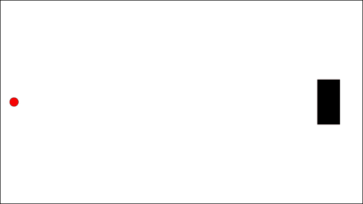

# Exemples pour démarrer


**We can add a class to the colliding elements to highlight them, for example a class called `.current` defined like this:**Ces exemples sont des cas simples pour comprendre rapidement le fonctionnement de HitboxJS.

* [Détecter n'importe quelle collision et ajouter une classe CSS](quickstart.md#exemple-1-detecter-nimporte-quelle-collision-et-ajouter-une-classe-css)
* [Détruire un "ennemi" avec une "balle"](quickstart.md#exemple-2-detruire-un-ennemi-avec-une-balle)

## Exemple \#1: Détecter n'importe quelle collision et ajouter une classe CSS

### Structure

Imaginons avoir des rectangles qui bougent sur une page, animés par CSS.







```markup
<div class="rectangle r1"></div>
<div class="rectangle r2"></div>
<div class="rectangle r3"></div>
```



```css
.rectangle {
  position: absolute;
  top: 0;
  left: 0;
  width: 50px;
  height: 50px;
  background-color: #de4242;
  animation: mouv1 infinite 5s linear;
  box-sizing: border-box;
}

.rectangle.r2 {
  animation-name: mouv2;
  background-color: #283575;
  height: 100px;
}
.rectangle.r3 {
  animation-name: mouv2;
  width: 100px;
  animation-direction: reverse;
  background-color: #30c444;
}

@keyframes mouv1 {
  from { transform: translate(0, 0); }
  20% { transform: translate(150px, 300px); }
  40% { transform: translate(400px, 40px); }
  60% { transform: translate(30px, 400px); }
  80% { transform: translate(700px, 240px); }
  to { transform: translate(0, 0); }
}

@keyframes mouv2 {
  from { transform: translate(250px, 250px); }
  20% { transform: translate(30px, 50px); }
  40% { transform: translate(400px, 40px); }
  60% { transform: translate(700px, 240px); }
  80% { transform: translate(150px, 300px); }
  to { transform: translate(250px, 250px); }
}
```







### Observer les collisions

Nous voulons effectuer une actions lorsque 2 `.rectangle`s sont en collisions. Pour commencer à observer les collisions, il faut créer une nouvelle instance de `Hitbox`\(que nous appellerons `hitboxWatcher`\), avec un sélecteur CSS comme paramètre `elements`.

```javascript
const hitboxWatcher = new Hitbox({
    elements: '.rectangle'
})
```

Hitbox va commencer à observer chaque `.rectangle` pour détecter les collisions.


`elements` peut être d'un type différent, voir [`elements`](../api/hitbox-object.md#elements) pour plus d'informations.


### Traiter les collisions

Maintenant, nous devons définir ce qui se passe lorsqu'une collision survient. Nous allons utiliser l'écouteur `onCollision()` pour logger dans la console quels éléments sont en collision.

```javascript
hitboxWatcher.onCollision(function(collision) {
    console.log(collision.element, collision.targetElement)
})
```

On observe que la fonction de renvoi est appelée avec un objet [`Collision`](../api/collision-object.md) en paramètre. Cet objet possède [plusieurs propriétés](../api/collision-object.md), mais les plus utiles sont:

| Propriété | Description |
| :--- | :--- |
| `element` | Le premier élément en collision |
| `targetElement` | The second element in the collision |
| `elements` | Tableau contenant `element` et `targetElement` |
| `overlap` | Un nombre entre 0 et 1 qui représente à quel point les deux éléments se superposent \(0 correspond à une absence totale de collision et 1 lorsqu'un élément recouvre totalement l'autre\). |

Cela va logger les éléments dans la console _à chaque fois qu'une collision sera en train d'avoir lieu_. Cela signifie que si deux éléments sont en collision durant une seconde, il y aura approximativement 60 logs dans la console.

### Ajout d'une classe lors du début d'une collision

Créons une classe qui mette en valeur les éléments lorsqu'ils sont en cours de collision, par exemple une classe `.colliding` définie de cette façon:

```css
.colliding {
  border: solid #f9ff07 3px;
  opacity: 0.4;
}
```

Nous n'avons pas besoin d'ajouter une classe à chaque instant de la collision, nous avons seulement besoin de l'ajouter au commencement d'une collision. Pour cela, nous pouvons utiliser l'écouteur `onCollisionStart()`.



```javascript
hitboxWatcher.onCollisionStart(function (collision) {
    collision.element.classList.add('colliding')
    collision.targetElement.classList.add('colliding')
})
```











C'est bien, mais on voudrait également retirer la classe lors de la fin de la collision. L'écouteur `onCollisionEnd()` permet ceci.



```javascript
hitboxWatcher.onCollisionEnd( function (collision) {
    collision.element.classList.remove('colliding')
    collision.targetElement.classList.remove('colliding')
})
```











## Exemple \#2: Détruire un "ennemi" avec une "balle"

Imaginons créer un jeu dans lequel un certain type d'élément détruit un autre type d'élément en le percutant \(par exemple un projectile sur un ennemi\). Nous voulons savoir lorsqu'un projectile percute un ennemi, mais pas lorsque deux projectiles ou deux ennemis se heurtent entre eux.







```markup
<div class="enemy"></div>
<div class="bullet"></div>
```



```css
.enemy {
  position: absolute;
  top: 175px;
  left: 700px;
  background-color: #000;
  height: 100px;
  width: 50px;
}

.bullet {
  position: absolute;
  width: 20px;
  height: 20px;
  background-color: #f00;
  border-radius: 10px;
  top: 215px;
  left: 20px;
  animation: bullet 3s linear;
}

@keyframes bullet {
  to {
    transform: translateX(790px);
  }
}
```







Pour cela, nous pouvons ajouter un autre paramètre lors de la création de notre objet `Hitbox`

```javascript
const hitboxWatcher = new Hitbox({
    elements: '.bullet',
    targetElements: '.enemy'
})
```

De cette manière, les événement de collision se déclencheront uniquement pour des collisions entre projectile et ennemi. Lors d'une collision, la propriété `element` de l'objet collision sera le projectile, et le `targetElement` sera l'ennemi.

À partir de là, on peut supprimer l'ennemi lorsqu'il est percuté.



```javascript
hitboxWatcher.onCollisionStart(function (collision) {
    collision.targetElement.remove()
})
```











_Et voilà !_

## Pour aller plus loin

Si vous avez besoin de plus de détails sur l'API de HitboxJS, vous pouvez lire la documentation complète.


